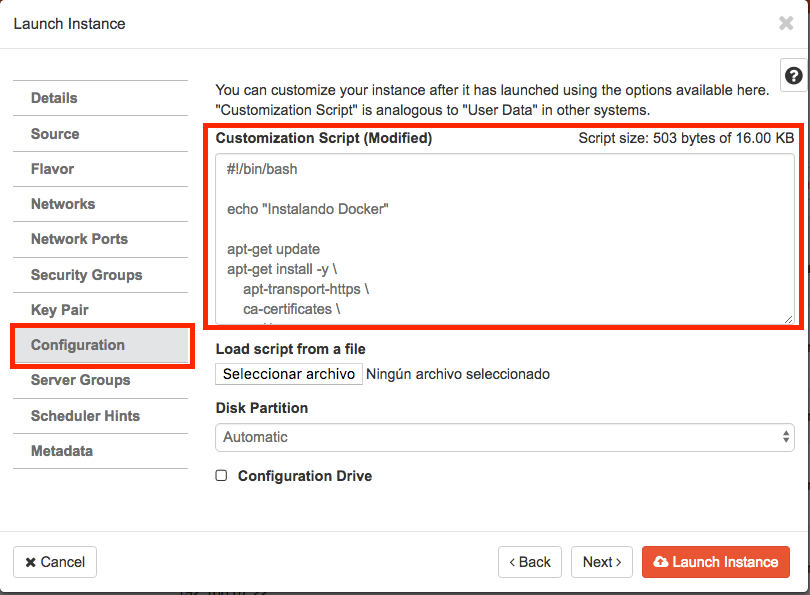

# Scripts de post-intalación en instancias

Al crear una instancia en OpenStack-DI es posible aprovisionarla o configurarla durante su proceso de creación. De esta forma, nuestras instancias ya tendrán instalados y configurados los paquetes necesarios.
 
Aqui podrás encontrar scripts para incluir en la pestaña de **Configuración** en la interfaz Horizon o para incluirlos en la línea de comandos si usas el CLI de OpenStack.



En la figura se ilustra la creación de una instancia Ubuntu con la instalación de Docker

```
#!/bin/bash

echo "Instalando Docker"

apt-get update
apt-get install -y \
    apt-transport-https \
    ca-certificates \
    curl \
    software-properties-common
curl -fsSL https://download.docker.com/linux/ubuntu/gpg | apt-key add -
apt-key fingerprint 0EBFCD88
add-apt-repository \
   "deb [arch=amd64] https://download.docker.com/linux/ubuntu \
   $(lsb_release -cs) \
   stable"
apt-get update
apt-get install -y docker-ce
groupadd docker
usermod -aG docker ubuntu
systemctl enable docker

exit 0
```

## Aviso

> Los scripts disponibles sólo son válidos para Ubuntu. No obstante, los scripts son fáciles de adaptar a otras distribuciones de Linux.


## Scripts disponibles

* [Docker CE](scripts/docker.sh)